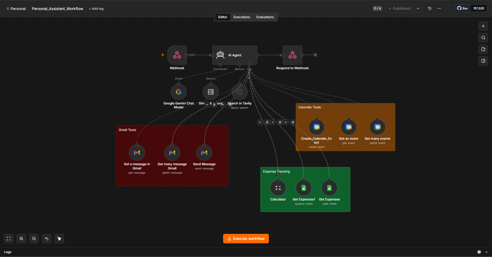

# 🤝 AI Personal Assistant

An AI-powered Personal Assistant built using **n8n**, **Google Gemini**, **Streamlit**, and **Google Workspace APIs**. The assistant understands natural language and automates productivity tasks such as calendar management, email handling, expense tracking, note management, and web search.

---

# 🚀 Features

- 📅 Create and manage Google Calendar events
- 📧 Read, summarize and send Gmail emails
- 🌐 Search the web using Tavily AI
- 💰 Track expenses using Google Sheets
- 🧮 Perform calculations
- 🤖 AI Agent with intelligent tool calling
- 💬 Interactive Streamlit chat interface

---

# 🛠️ Tech Stack

| Technology | Purpose |
|------------|---------|
| Python | Backend |
| Streamlit | User Interface |
| n8n | Workflow Automation |
| Google Gemini | Large Language Model |
| Google Calendar API | Calendar Management |
| Gmail API | Email Management |
| Google Sheets API | Expense Tracking |
| Tavily Search | Web Search |
| Docker | Self-hosted n8n |

---

# 📸 Screenshots

## Personal Assistant UI



---

## n8n Workflow


# 📂 Project Structure

```text
AI-Personal-Assistant
│
├── app.py
├── requirements.txt
├── README.md
├── LICENSE
│
├── workflow
│   └── Personal_Assistant_Workflow.json
│
└── screenshots
    ├── assistant-ui.png
    ├── workflow.png
    ├── calendar.png
    ├── gmail.png
    └── expenses.png
```

---

# ⚙️ Installation

Clone the repository

```bash
git clone https://github.com/YOUR_USERNAME/AI-Personal-Assistant.git
```

Move into the project

```bash
cd AI-Personal-Assistant
```

Install dependencies

```bash
pip install -r requirements.txt
```

Run the Streamlit application

```bash
streamlit run app.py
```

---

# 🔧 n8n Setup

1. Import the workflow located inside the `workflow` folder.
2. Configure the following credentials:
   - Google Gemini API
   - Google Calendar
   - Gmail
   - Google Sheets
   - Tavily Search
3. Activate the workflow.
4. Update the webhook URL inside `app.py`.
5. Start chatting with your AI assistant.

---

# 💡 Example Commands

```
Create a meeting tomorrow at 10 AM

Summarize my unread emails

Add ₹500 for groceries

Show my expenses this month

Search today's AI news
```

---

# 🚀 Future Improvements

- 🎤 Voice Assistant
- 📄 Google Docs integration
- ✅ Google Tasks support
- 📱 Telegram Bot
- 💬 WhatsApp Integration
- 📊 Analytics Dashboard
- 🧠 Long-term Memory (RAG)

---

# 👨‍💻 Author

**Parth Khandagale**

- LinkedIn: (https://www.linkedin.com/in/parth-khandagale-623532243/)
- GitHub: (https://github.com/ParthGitthub)

---

# ⭐ If you found this project interesting, consider giving it a star!
